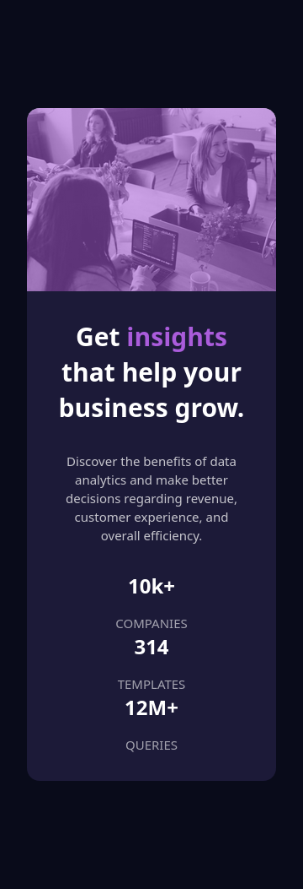

# Frontend Mentor - Stats preview card component solution

This is a solution to the [Stats preview card component challenge on Frontend Mentor](https://www.frontendmentor.io/challenges/stats-preview-card-component-8JqbgoU62). Frontend Mentor challenges help you improve your coding skills by building realistic projects.

## Table of contents

- [Overview](#overview)
  - [The challenge](#the-challenge)
  - [Screenshot](#screenshot)
  - [Links](#links)
- [My process](#my-process)
  - [Built with](#built-with)
  - [What I learned](#what-i-learned)
  - [Continued development](#continued-development)
  - [Useful resources](#useful-resources)
- [Author](#author)

## Overview

### The challenge

Users should be able to:

- View the optimal layout depending on their device's screen size

### Screenshot

### Links

- Solution URL: [Add solution URL here](https://your-solution-url.com)
- Live Site URL: [Add live site URL here](https://your-live-site-url.com)

## My process

### Built with

- Semantic HTML5
- CSS Flexbox
- Mobile-first workflow
- Responsive images using the <picture> element
- CSS custom styling (overlay using positioning)

### What I learned

- height: 100% only works when the parent has a defined height
- Flexbox controls height differently depending on layout direction
- Responsive layouts require careful handling of image sizing

### Continued development

- I would like to come back to this project once i've learned css grid cause i used flexbox
- I would also like to use custom css properties on this project once i learn it.
- I i would make sure to comeback and make it more accessible.

## Author

- Frontend Mentor - [@devfredx1](https://www.frontendmentor.io/profile/devfredx1)
- Twitter - [@devfredx](https://x.com/DevFredX)
